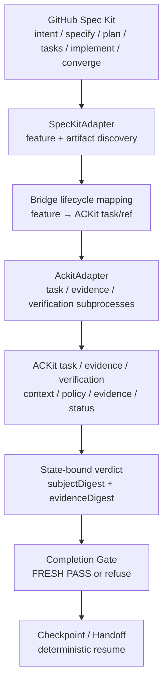

# ACKit Spec Kit Bridge

<p align="center">
  <strong>Connect GitHub Spec Kit's intent-driven development workflow to ACKit's deterministic task, evidence, verification, freshness, completion-gate, checkpoint, and handoff system.</strong>
</p>

<p align="center">
  <a href="https://www.npmjs.com/package/@cynrath/ackit-spec-kit-bridge"></a>
  <a href="https://www.npmjs.com/package/@cynrath/ackit-spec-kit-bridge"></a>
  <a href="https://github.com/Cynrath/ackit-spec-kit-bridge"></a>
  <a href="https://github.com/Cynrath/ackit-spec-kit-bridge/actions/workflows/ci.yml"></a>
</p>

<p align="center">
  <a href="https://github.com/Cynrath/ackit-spec-kit-bridge/releases/latest"></a>
  <a href="https://opensource.org/licenses/MIT"></a>
  <a href="https://www.npmjs.com/package/@cynrath/ackit-spec-kit-bridge"></a>
  
  
  
</p>

> **Community integration for ACKit and GitHub Spec Kit. Not an official GitHub integration.**

Spec Kit owns intent: `specify → plan → tasks → implement → converge`.
ACKit owns trust: repository context, policy, evidence, verification, completion trust, status, checkpoint, handoff.
The bridge coordinates the two — it replaces neither.

## Demo (60 seconds)

```powershell
npm install --global @cynrath/ackit-spec-kit-bridge
ackit-speckit doctor
ackit-speckit sync
ackit-speckit status
ackit-speckit verify --profile standard
ackit-speckit gate
```

Stale-state protection — the core guarantee:

```powershell
ackit-speckit verify --profile standard   # PASS (exit 0), binds subject + evidence digests
ackit-speckit gate                        # PASS (exit 0)
# ... edit specs/001-*/spec.md, plan.md, tasks.md, or mapped ACKit task/config ...
ackit-speckit status                      # STALE
ackit-speckit gate                        # FAIL (exit 1, VERDICT_STALE)
ackit-speckit verify --profile standard   # PASS again (exit 0), fresh verdict
ackit-speckit gate                        # PASS (exit 0)
```

Exit codes: `0` success/pass · `1` gate/verification failed or stale · `2` usage/config error · `3` environment/dependency error · `4` security boundary violation · `5` internal error.

## Why

Without the bridge, Spec Kit and ACKit live in separate worlds:

| Before | With Bridge |
|---|---|
| Spec Kit creates intent/spec/plan/tasks, but ACKit lifecycle, evidence, verdict, and completion state are separate | Spec Kit artifacts become explicit ACKit refs via `sync` |
| Verification (if any) floats free of the exact state it checked | Verification binds `subjectDigest + evidenceDigest + profile + result` |
| Editing a spec after "done" silently invalidates prior conclusions | Any subject change flips the verdict to `STALE` |
| Completion is a judgment call | Completion is refused until a fresh verification passes (`gate`) |
| Resuming later means re-reading everything | `checkpoint` / `handoff` export deterministic resume context |

## Install

```powershell
npm install --global @cynrath/ackit-spec-kit-bridge
ackit-speckit --version
ackit-speckit --help
```

Pinned install:

```powershell
npm install --global @cynrath/ackit-spec-kit-bridge@0.1.1
```

POSIX shells work identically (`ackit-speckit doctor`, etc.).

## Prerequisites

- Node.js >= 22, pnpm 11
- ACKit CLI (`npm install -g @cynrath/agent-context-kit`, tested 0.5.4, min 0.5.0)
- Spec Kit `specify` CLI (tested 1.0.13, min 1.0.0; Python 3.11+ via `uv tool install specify-cli`)
- Git, PowerShell 7+ on Windows

`ackit-speckit doctor` checks every prerequisite with stable check IDs and reports `ok`/`fail` per check.

## Quickstart

```powershell
git init
ackit init
specify init --here --integration copilot
ackit-speckit init
ackit-speckit sync
ackit-speckit status --json
ackit-speckit verify --profile standard
ackit-speckit gate
```

Full lifecycle:

```powershell
ackit-speckit sync                            # TASKED
ackit-speckit status                          # canonical state (read-only, never writes)
ackit-speckit verify --profile standard       # PASS, binds subject + evidence digests
ackit-speckit gate                            # PASS
ackit-speckit checkpoint                      # deterministic resume point
ackit-speckit handoff                         # human/agent handoff (markdown or JSON)
ackit-speckit complete                        # COMPLETE — only after a fresh PASS gate
```

Every `--json` payload validates against [`schemas/`](schemas/).

## Features

Only implemented, tested behavior is listed.

| Area | Capability |
|---|---|
| Discovery | Active Spec Kit feature resolution (`specs/NNN-*` + active tracking) |
| Discovery | Spec Kit artifact discovery (spec.md, plan.md, tasks.md, checklists) |
| Sync | Spec Kit → ACKit task/ref synchronization (`sync`, idempotent re-runs) |
| Sync | Idempotent sync — same state in, same mapping out, no duplicates |
| Lifecycle | Canonical lifecycle status (`status`, read-only, never writes) |
| Verification | State-bound verification bundles (`verify`, per-profile checks) |
| Verification | Subject digest (spec/plan/tasks, ACKit task/config/policy, bridge config/profile/version, tool versions, Git HEAD/diffs) |
| Verification | Evidence digest (redacted per-check outputs, content-addressed refs) |
| Verification | Verdict freshness (`FRESH` / `STALE` / `NOT_VERIFIED`) |
| Verification | Stale detection on any subject change (`stalePolicy: fail`) |
| Verification | `quick` / `standard` / `high-risk` profiles (ranked; higher satisfies lower) |
| Gate | Completion gate (`gate`, read-only; STALE fails with exit 1) |
| Continuity | Deterministic checkpoints (`checkpoint`, resume context) |
| Continuity | Human/agent handoffs (`handoff --format markdown|json`) |
| Provenance | `explain` — lifecycle derivation + gate provenance |
| Doctor | `doctor` — environment + compatibility checks with stable check IDs |
| Contracts | Deterministic JSON schemas for config, status, bundles, verdicts, checkpoints, handoffs |
| Spec Kit | Native extension (`spec-kit/extension`, id `ackit`, 7 `speckit.ackit.*` commands + lifecycle hooks) |
| Spec Kit | Workflow package (`spec-kit/workflow`, `ackit-verified-sdd`) |
| Hooks | `after_specify` / `after_plan` / `after_tasks` → sync; `before_implement` → status preflight; `after_implement` → verify (never auto-completes) |
| Platform | Windows + Linux (CI); macOS best-effort |
| Runtime | Offline-first — no network calls, no telemetry, no LLM/API dependency |
| Safety | Subprocess argv arrays with `shell: false`; path containment; bounded reads/output; redacted evidence; atomic state writes |
| Quality | Package/CI smoke (`smoke:cli`, `smoke:extension`, `smoke:package`); ACKit dogfooding (`config check`, `scan --ci`, `policy check`) |

## How it works



Ownership is explicit:

- **Spec Kit owns:** intent, `specify`, `plan`, `tasks`, `implement`, converge.
- **ACKit owns:** repository context, policy, evidence, verification trust, completion trust, status, checkpoint, handoff.
- **The bridge owns:** discovery, mapping, digest computation, bundle assembly, freshness comparison, gate evaluation, checkpoint/handoff rendering — coordination only.

## CLI overview

| Command | Purpose |
|---|---|
| `init [--dry-run]` | Verify repo/ACKit/Spec Kit, write config + state dirs + mapping |
| `doctor [--json]` | Environment + compatibility checks with stable check IDs |
| `sync [--dry-run]` | Map active Spec Kit feature → ACKit task (idempotent) |
| `status [--json]` | Read-only canonical lifecycle state (never writes) |
| `verify --profile quick\|standard\|high-risk [--json]` | State-bound bundle + verdict |
| `gate [--json]` | Read-only completion gate (STALE fails) |
| `checkpoint [--json]` | Deterministic resume checkpoint |
| `handoff [--format markdown\|json]` | Human/agent handoff |
| `complete [--json]` | Gate-checked ACKit task completion |
| `explain [--json]` | Lifecycle + gate provenance |
| `version [--json]` | Bridge + compat versions |

<details>
<summary>Exit codes and JSON contracts</summary>

Exit codes: `0` success/pass · `1` gate/verification failed or stale · `2` usage/config error · `3` environment/dependency error · `4` security boundary violation · `5` internal error.

JSON schemas live in [`schemas/`](schemas/): config, status (`ackit.speckit.status.v1`), verification bundle, verdict (`ackit.verdict.v1/v2` family), checkpoint, handoff, error (`ackit.speckit.error.v1`).

</details>

## Lifecycle states

Derived deterministically (`deriveLifecycle`); `BLOCKED` wins over everything except `UNINITIALIZED`; `COMPLETE` requires a fresh `PASS` plus a completed ACKit task.

| State | Meaning |
|---|---|
| `UNINITIALIZED` | ACKit or Spec Kit not initialized |
| `READY` | Initialized; no active feature (or spec missing) |
| `SPECIFIED` | Spec present, plan missing |
| `PLANNED` | Plan present, tasks/mapping missing |
| `TASKED` | Tasks + mapping present, no verdict yet |
| `IMPLEMENTING` | Verdict `FAIL` (work to do) |
| `VERIFYING` | (transient) verification running |
| `VERIFIED` | Fresh `PASS` verdict |
| `STALE` | Verdict exists but subject moved — re-verify |
| `BLOCKED` | Explicit block reason |
| `COMPLETE` | Task completed with a fresh `PASS` |

Details: [`docs/architecture/lifecycle.md`](docs/architecture/lifecycle.md), [`docs/reference/lifecycle-status.md`](docs/reference/lifecycle-status.md).

## Verification / freshness model

A verdict binds `subjectDigest + evidenceDigest + profile + result`.

- `subjectDigest` covers Spec Kit artifacts, the ACKit task/config/policy snapshot, bridge config/profile/version, tool versions, and Git HEAD/diffs.
- `evidenceDigest` covers the redacted per-check outputs.
- `status` / `gate` recompute the subject digest and compare it with the stored verdict: `FRESH`, `STALE`, or `NOT_VERIFIED`.
- `stalePolicy: fail` (the only mode) means `STALE` fails the gate with `VERDICT_STALE` and exit 1.

Details: [`docs/architecture/state-digest.md`](docs/architecture/state-digest.md), [`docs/concepts/verification-freshness.md`](docs/concepts/verification-freshness.md).

## Verification profiles

Ranked `quick < standard < high-risk`; a higher-rank verdict satisfies a lower-rank gate (`profileSatisfies`).

- `quick` — bridge config validation + ACKit config check (fast preflight).
- `standard` — quick plus Spec Kit artifact presence, mapping integrity, ACKit scan/policy surface (default; CI recommended).
- `high-risk` — standard plus extended evidence capture and strict completeness (release-grade changes).

```powershell
ackit-speckit verify --profile quick
ackit-speckit verify --profile standard
ackit-speckit verify --profile high-risk
```

## Spec Kit extension

Native extension (`spec-kit/extension`, id `ackit`):

```powershell
specify extension add ackit --dev ./spec-kit/extension
specify extension list
specify artifact list --json
```

Commands: `speckit.ackit.sync|status|verify|gate|checkpoint|handoff|complete` (each delegates to `ackit-speckit`).
Hooks: `after_specify`, `after_plan`, `after_tasks` → sync; `before_implement` → status preflight; `after_implement` → verify (never auto-completes).

See [`docs/guides/spec-kit-extension.md`](docs/guides/spec-kit-extension.md).

## Spec Kit workflow

Workflow package `spec-kit/workflow/workflow.yml` (`ackit-verified-sdd`): spec → plan → tasks → sync → implement → verify → gate → checkpoint/handoff → complete. Hooks enforce verification after implementation and refuse completion on stale verdicts.

## Configuration

`.ackit-spec-kit/config.yml` (schema version 1):

```yaml
schemaVersion: 1
ackit:
  command: ackit
  minVersion: 0.5.0
specKit:
  command: specify
  minVersion: 1.0.0
mapping:
  mode: active-feature
verification:
  defaultProfile: standard
  stalePolicy: fail
profiles:
  quick: {}
  standard: {}
  high-risk: {}
evidence:
  redact: true
```

State lives under `.ackit-spec-kit/` (`state/`, `verdicts/`, `bundles/`, `checkpoints/`, `handoffs/`, `evidence/`, `mapping.json`) — never commit verdicts/bundles as source of truth; they are derived.

See [`docs/reference/configuration.md`](docs/reference/configuration.md).

## JSON schemas

[`schemas/`](schemas/) holds deterministic contracts for config, status, verification bundles, verdicts, checkpoints, and handoffs. Every `--json` payload validates against them; CI re-validates fixtures on each run.

See [`docs/reference/schemas.md`](docs/reference/schemas.md).

## Security

Offline-first runtime: no network calls, no telemetry, no uploads, no LLM/API dependency in product code. Subprocesses use argv arrays with `shell: false`. Path containment anchors all reads/writes to the repository root. Reads and outputs are size-bounded. Evidence is redacted at construction. State writes are atomic.

See [`docs/architecture/security-model.md`](docs/architecture/security-model.md) and [`SECURITY.md`](SECURITY.md).

## CI

```yaml
- run: npx --yes @cynrath/ackit-spec-kit-bridge doctor
- run: ackit-speckit verify --profile standard
- run: ackit-speckit gate
```

Gate failures exit 1 and fail the pipeline. See [`docs/guides/ci.md`](docs/guides/ci.md).

## Compatibility

| Component | Supported / tested |
|---|---|
| Node | >= 22 (tested 24.13.0) |
| pnpm | 11.22.0 |
| ACKit | >= 0.5.0 (tested 0.5.4) |
| Spec Kit (`specify`) | >= 1.0.0 (tested 1.0.13) |
| Windows | supported (PowerShell 7+) |
| Linux (Ubuntu) | supported (CI) |
| macOS | best-effort (not tested in v0.1.1) |

Bridge versioning is independent from ACKit and Spec Kit versions (semver). `doctor` reports live compatibility. See [`docs/reference/compatibility.md`](docs/reference/compatibility.md).

## Hosted documentation

- Bridge docs: <https://cynrath.github.io/ackit-spec-kit-bridge/>
- ACKit docs: <https://cynrath.github.io/agent-context-kit/>
- Cynrath home: <https://cynrath.github.io/>

## Development

```powershell
pnpm install --frozen-lockfile
pnpm lint
pnpm format:check
pnpm typecheck
pnpm build
pnpm test
pnpm smoke:cli
pnpm smoke:extension
pnpm smoke:package
node dist/cli/index.js doctor
```

ACKit dogfooding: `ackit config check`, `ackit scan --ci`, `ackit policy check`, `ackit readiness`.

## Release model

Releases are tag-driven: push `vX.Y.Z` → GitHub Actions (`release.yml`) → OIDC Trusted Publishing (`npm publish --provenance`, no tokens) → registry/shasum/fresh-consumer verification → GitHub Release with the exact tarball, extension/workflow archives, and checksums.

Normal releases require no manual npm approval. An optional staged mode (`npm stage publish` → manual security-key approval) exists for maximum-assurance publishes but is not the default.

See [`docs/guides/release.md`](docs/guides/release.md).

## Roadmap

See [`ROADMAP.md`](ROADMAP.md). Direction: deeper Spec Kit lifecycle coverage, richer verification evidence, and tighter ACKit ecosystem links — without duplicating ACKit core or implying official GitHub status.

## Links

- Bridge repo: <https://github.com/Cynrath/ackit-spec-kit-bridge>
- npm: <https://www.npmjs.com/package/@cynrath/ackit-spec-kit-bridge>
- Hosted docs: <https://cynrath.github.io/ackit-spec-kit-bridge/>
- ACKit: <https://github.com/Cynrath/agent-context-kit>
- ACKit npm: <https://www.npmjs.com/package/@cynrath/agent-context-kit>
- Spec Kit upstream: <https://github.com/github/spec-kit>
- Cynrath: <https://cynrath.github.io/>

## License

MIT — see [`LICENSE`](LICENSE).
